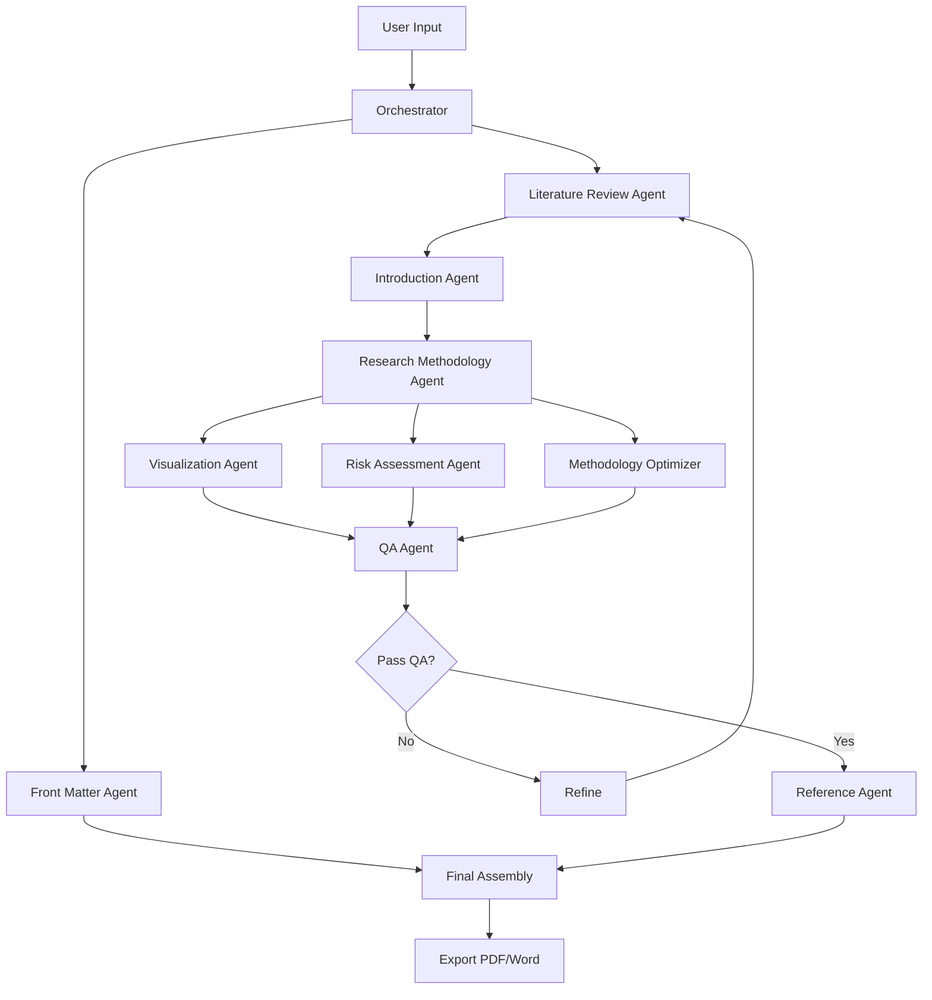

# System Architecture

## Overview
This document describes the architecture of the Multi-Agentic Research Proposal Generation System, a sophisticated application that generates Q1 journal-standard research proposals using collaborative AI agents.

## Design Principles

### 1. Virtual Scientists Collaborative Model
- Specialized agents act as domain experts
- Iterative refinement through feedback loops
- Peer review and quality assurance mechanisms
- Knowledge sharing through centralized state management

### 2. Task Decomposition Framework
- Hierarchical task breakdown (inspired by Magentic-One)
- Central orchestrator coordinates all agents
- Dynamic task assignment based on dependencies
- Error handling and recovery mechanisms

### 3. Hybrid Execution Model
- **Parallel Execution**: Independent tasks run concurrently
  - Front matter generation
  - Risk assessment
  - Visualization creation
- **Sequential Execution**: Dependent tasks follow DAG
  - Literature Review → Introduction → Methodology
  - Quality checkpoints between major sections

## System Components

### Core Layer

#### 1. Central Orchestrator Agent
```
┌─────────────────────────────────────┐
│   Central Orchestrator Agent        │
├─────────────────────────────────────┤
│ • Task Decomposition                │
│ • Agent Assignment                  │
│ • Workflow Management               │
│ • Inter-agent Communication         │
│ • State Management                  │
│ • Error Handling                    │
└─────────────────────────────────────┘
```

**Responsibilities:**
- Parse user input (topic + key points)
- Create structured task plan (DAG)
- Assign tasks to specialized agents
- Manage agent execution order
- Handle errors and retries
- Coordinate feedback loops

**Technology:**
- LangGraph for workflow orchestration
- Redis for state management
- Directed Acyclic Graph (DAG) for dependencies

### Agent Layer

#### Content Generation Agents

##### 1. Literature Review Agent
```
Input: Research topic, key points, year constraints
Process:
  1. Query MCP servers (Semantic Scholar, arXiv, Frontiers)
  2. Retrieve 30+ papers (last 6 years priority)
  3. Analyze and extract key findings
  4. Synthesize into thematic review
  5. Identify research gaps
  6. Paraphrase for Turnitin compliance
Output: Chapter 2 content + research gaps + citations
```

##### 2. Research Methodology Agent
```
Input: Research gaps, objectives from Introduction
Process:
  1. Analyze research requirements
  2. Design experimental framework
  3. Generate process flow diagram (Mermaid.js)
  4. Detail data collection procedures
  5. Specify analysis methods
  6. Address ethical considerations
  7. Plan resource requirements
Output: Chapter 3 content + diagrams + resource plan
```

##### 3. Visualization Agent
```
Input: Methodology details, data requirements
Process:
  1. Generate process flow diagrams (Mermaid.js)
  2. Create model architecture illustrations
  3. Design data analysis charts (Plotly/Seaborn)
  4. Ensure professional formatting
Output: All diagrams and visualizations
```

##### 4. Introduction Agent
```
Input: Literature review gaps, research context
Process:
  1. Formulate problem statement
  2. Define research objectives
  3. Establish significance
  4. Structure introduction narrative
Output: Chapter 1 content
```

#### Quality Assurance Agent
```
Input: Draft proposal sections
Process:
  1. Structure evaluation
  2. Clarity and coherence check
  3. Academic integrity verification
  4. Turnitin compliance check
  5. Citation accuracy validation
  6. Format compliance verification
Output: Feedback + recommendations + approval status
```

#### Document Structure Agents

##### Structure & Formatting Agent
- Applies Times New Roman font
- Manages margins and spacing
- Generates table of contents
- Ensures section numbering consistency

##### Front Matter Agent
- Dedication page (editable)
- Acknowledgements
- Abstract (200-300 words)
- Keywords (5-8 terms)
- List of abbreviations

##### Reference & Citation Agent
- Manages Harvard-style citations
- Compiles bibliography
- Sequences references by usage order
- Validates citation accuracy

##### Final Assembly Agent
- Compiles all sections
- Generates appendices
- Creates research plan
- Exports to PDF/Word

#### Advanced Feature Agents

##### Risk Assessment Agent
```
Input: Research plan, constraints
Process:
  1. Identify technical risks
  2. Identify temporal risks
  3. Identify personal risks
  4. Develop mitigation strategies
  5. Create contingency plans
Output: Risk assessment + mitigation plan
```

##### AI-Assisted Methodology Optimizer
```
Input: Research topic, proposed methodology
Process:
  1. Analyze successful proposals in field
  2. Identify common methodological approaches
  3. Detect potential pitfalls
  4. Recommend optimal design
Output: Methodology recommendations + justifications
```

### Data Layer

#### MCP Server Integration
```
┌────────────────────────────────────┐
│      MCP Server Layer              │
├────────────────────────────────────┤
│  ┌──────────────────┐             │
│  │ Semantic Scholar │  30+ papers │
│  └──────────────────┘             │
│  ┌──────────────────┐             │
│  │      arXiv       │  Preprints  │
│  └──────────────────┘             │
│  ┌──────────────────┐             │
│  │    Frontiers     │  OA Journals│
│  └──────────────────┘             │
└────────────────────────────────────┘
```

**Features:**
- Parallel querying for speed
- Result deduplication
- Relevance scoring
- Citation extraction
- Full-text retrieval
- Metadata normalization

#### Vector Database
```
Purpose: Knowledge Base & Semantic Search
Technology: ChromaDB / Pinecone
Storage:
  • Retrieved papers and abstracts
  • Generated sections for context
  • Template examples
  • Successful proposal patterns
```

#### State Management
```
Technology: Redis
Purpose:
  • Workflow state tracking
  • Inter-agent message passing
  • Task queue management
  • Cache for API responses
```

## Workflow Architecture

### Request Flow
```
User Input
    ↓
Central Orchestrator
    ↓
Task Decomposition
    ↓
┌─────────────────────────────────┐
│   Parallel Group 1              │
│   • Front Matter Agent          │
│   • Structure Agent             │
└─────────────────────────────────┘
    ↓
Literature Review Agent (30+ papers)
    ↓
┌─────────────────────────────────┐
│   Sequential Flow               │
│   Literature Review → Introduction
│           ↓
│   Introduction → Methodology
│           ↓
│   Methodology → Visualization
└─────────────────────────────────┘
    ↓
┌─────────────────────────────────┐
│   Parallel Group 2              │
│   • Risk Assessment             │
│   • Methodology Optimizer       │
└─────────────────────────────────┘
    ↓
Quality Assurance Agent
    ↓
┌───────────────────────┐
│  Feedback Loop?       │
│  Yes → Refine         │
│  No → Continue        │
└───────────────────────┘
    ↓
Reference & Citation Agent
    ↓
Final Assembly Agent
    ↓
PDF/Word Export
    ↓
Deliverable (~15,000 words)
```

### Task Dependency Graph (DAG)


## Communication Patterns

### 1. Orchestrator-Agent Communication
```
Protocol: Direct Message Passing
Pattern: Request-Response

Orchestrator → Agent:
{
  "task_id": "LIT_REV_01",
  "agent": "literature_review",
  "action": "generate_chapter_2",
  "input": {
    "topic": "Machine Learning in Healthcare",
    "key_points": [...],
    "requirements": {...}
  },
  "context": {...}
}

Agent → Orchestrator:
{
  "task_id": "LIT_REV_01",
  "status": "completed",
  "output": {
    "content": "...",
    "metadata": {...},
    "citations": [...]
  },
  "next_actions": [...]
}
```

### 2. Inter-Agent Communication
```
Protocol: Publish-Subscribe via Redis
Pattern: Event-Driven

Agent publishes:
{
  "event": "literature_review_complete",
  "data": {
    "research_gaps": [...],
    "key_findings": [...],
    "citations": [...]
  }
}

Dependent agents subscribe and receive data
```

### 3. QA Feedback Loop
```
QA Agent → Content Agent:
{
  "section": "Chapter 2",
  "status": "needs_revision",
  "feedback": [
    {
      "issue": "Insufficient gap analysis",
      "severity": "high",
      "suggestion": "Expand section 2.3 with 3 specific gaps"
    }
  ],
  "iteration": 1
}
```

## Data Models

### Core Models

#### ProposalRequest
```python
class ProposalRequest(BaseModel):
    topic: str
    key_points: List[str]
    user_id: Optional[str]
    custom_requirements: Optional[Dict[str, Any]]
    priority: str = "normal"
```

#### WorkflowState
```python
class WorkflowState(BaseModel):
    request_id: str
    status: WorkflowStatus
    current_stage: str
    completed_tasks: List[TaskResult]
    pending_tasks: List[Task]
    errors: List[Error]
    metadata: Dict[str, Any]
```

#### TaskResult
```python
class TaskResult(BaseModel):
    task_id: str
    agent_name: str
    status: TaskStatus
    output: Dict[str, Any]
    duration: float
    error: Optional[str]
```

## Technology Stack

### Core Framework
- **Language**: Python 3.11+
- **Agent Framework**: LangGraph (primary), AutoGen/CrewAI (alternative)
- **LLM**: Claude 3.5 Sonnet (primary), GPT-4 (fallback)
- **Workflow**: Apache Airflow / Prefect
- **API**: FastAPI
- **Async**: asyncio, aiohttp

### Data Storage
- **Vector DB**: ChromaDB (local), Pinecone (cloud)
- **Cache**: Redis
- **Relational DB**: PostgreSQL (production), SQLite (development)

### External Services
- **Academic APIs**: Semantic Scholar, arXiv, Frontiers
- **Monitoring**: Prometheus + Grafana
- **Logging**: Loguru
- **Error Tracking**: Sentry

## Scalability Considerations

### Horizontal Scaling
- Stateless agent design
- Redis-based state sharing
- Load balancing via NGINX/Traefik
- Containerized deployment (Docker/Kubernetes)

### Performance Optimization
- Parallel agent execution
- Response caching (Redis)
- Database query optimization
- Async I/O operations
- LLM response streaming

### Resource Management
- Agent pool with max concurrent limit
- Rate limiting for external APIs
- Circuit breaker pattern for failures
- Graceful degradation

## Security

### API Security
- JWT authentication
- Rate limiting
- CORS configuration
- Input validation & sanitization

### Data Protection
- API key encryption at rest
- Secure environment variable management
- Audit logging
- PII handling compliance

## Monitoring & Observability

### Metrics
- Request latency
- Agent execution time
- API usage (token consumption)
- Error rates by agent
- Cache hit rates

### Logging
- Structured JSON logging
- Agent decision logging
- Inter-agent communication logs
- Error stack traces

### Alerts
- Agent failure threshold
- API rate limit approaching
- Quality check failures
- System resource usage

## Deployment Architecture

### Development
```
Local Machine
├── API Server (FastAPI)
├── Redis (Docker)
├── ChromaDB (Local)
└── Agents (In-process)
```

### Production
```
Kubernetes Cluster
├── API Pods (3+ replicas)
├── Agent Worker Pods (5+ replicas)
├── Redis Cluster
├── PostgreSQL (Managed)
└── Pinecone (External)
```

## Future Enhancements

1. **Multi-Language Support**: Generate proposals in multiple languages
2. **Custom Templates**: User-defined proposal structures
3. **Real-Time Collaboration**: Multiple users editing same proposal
4. **Version Control**: Track proposal revisions
5. **Citation Management Integration**: Zotero/Mendeley integration
6. **Advanced Visualization**: Interactive diagrams
7. **Peer Review Simulation**: Multiple QA agents with different perspectives
8. **Fine-Tuned Models**: Domain-specific LLMs for better quality
